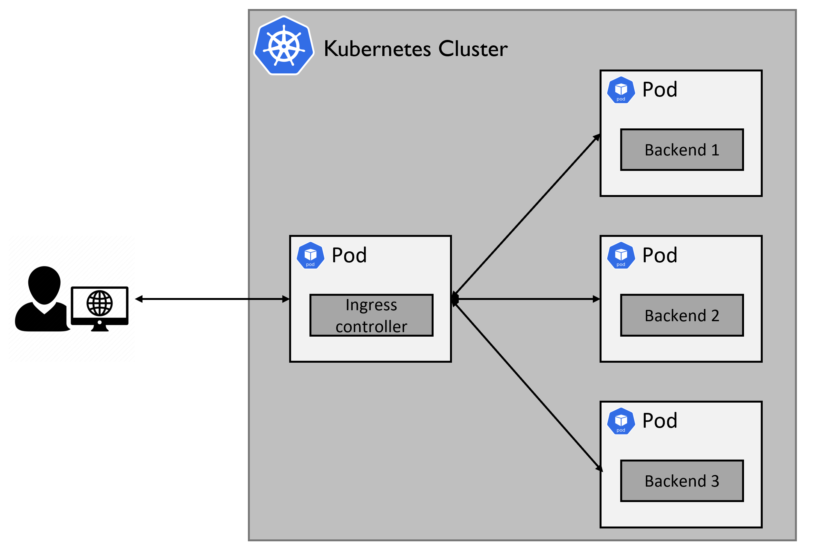

# Kubernetes Ingress Controller 

## Introduction
In the following tasks you are going to deploy and modify an ingress controller. The ingress controller will be deployed in a Kubernetes cluster hosted on your local computer.  
An ingress controller is a component that manages inbound network traffic to backend services within the cluster. It acts as an entry point for external traffic to reach the backend services running inside the cluster.  
When a client sends a request to access a service, it first reaches the ingress controller. The ingress controller then examines the request and determines how to route it to the appropriate service based on pre-defined rules.
The following figure illustrates the ingress controller functionality:  
  

In our case, the services in the cluster are registered at the ingress-controller using a `SimpleIngress` Kubernetes custom resource.  
The `SimpleIngress` has the following structure:
```yaml
apiVersion: webapp.my.domain/v1
kind: SimpleIngress
metadata:
  name: <resource-name>
  namespace: <resource-namespace>
spec:
  svcName: <service-name> 
  host: <service-name>
```
* `svcName` - The name of the Kubernetes Service resource that exposes the backend service.  
* `host` - The host name the client should use to access the service. This host name comes as a prefix to the cluster's public address. For example, if the cluster's address is `http://127.0.0.1.nip.io/` and the `host` is "my-host" the public address of the backend is `http://my-host.127.0.0.1.nip.io/`.  

## Prerequisites
Before continuing to the tasks, ensure the following tools are installed on your computer:  
* [Git](https://git-scm.com/book/en/v2/Getting-Started-Installing-Git).  
* [Go](https://go.dev/doc/install) programing language (version 1.21 or above).  
* [Docker](https://docs.docker.com/engine/install/).  
* [kind](https://kind.sigs.k8s.io/docs/user/quick-start/).  
* [kubectl](https://kubernetes.io/docs/tasks/tools/).  

## Clone the Ingress Controller Repository
To access the files in this repository you should first clone it to your local computer.  
```shell
git clone https://github.wdf.sap.corp/I531295/Ingress-Controller.git
cd Ingress-Controller
``` 

## Task 1 - Create Your Kubernetes Cluster
The following steps will guide you through creating the local Kubernetes cluster, including the ingress controller and example backend services.  

### Step 1.1 - Create a KIND cluster
To create a Kubernetes cluster using KIND, run the following command in your terminal (make sure your Docker engine is running first):
```shell
kind create cluster --config kind-config.yaml
```
If the installation was successful, you should see an output similar to the following:  
```shell
Creating cluster "kind" ...
 ✓ Ensuring node image (kindest/node:v1.30.0) 🖼
 ✓ Preparing nodes 📦
 ✓ Writing configuration 📜
 ✓ Starting control-plane 🕹️
 ✓ Installing CNI 🔌
 ✓ Installing StorageClass 💾
Set kubectl context to "kind-kind"
You can now use your cluster with:

kubectl cluster-info --context kind-kind

Have a nice day! 👋
```
To ensure your kubectl context is pointing to your kind cluster, run the following command:  
```shell
kubectl cluster-info
```
The output should be similar to the following:  
```shell
Kubernetes control plane is running at https://127.0.0.1:43581
CoreDNS is running at https://127.0.0.1:43581/api/v1/namespaces/kube-system/services/kube-dns:dns/proxy

To further debug and diagnose cluster problems, use 'kubectl cluster-info dump'.
```

### Step 1.2 - Deploy the Resources
#### Ingress controller
To deploy the ingress controller and its related resources, run the following command:  
```shell
kubectl apply -f manifests/ingress-controller.yaml
```
Ensure the ingress-controller pod is running by running the following command (it might take it a few seconds to reach the "Running" status):
```shell
kubectl get pods -n ingress-system
```
You should see the ingress-controller pod and its status in the command output.  

#### Backends
To deploy the backend services, run the following command:
```shell
kubectl apply -f manifests/backends/
```
The command above should create two Pods (simple-backend and echo-server) and 2 Services (simple-backend-svc and echo-server-svc).  
Check they exist by running the following command: 
```shell
kubectl get pods -n default
kubectl get services -n default
```
#### SimpleIngress Custom Resources
To deploy the SimpleIngress custom resource run the following command:
```shell
kubectl apply -f manifests/simpleIngress/
```

### Step 1.3 - Validate the Installation 
After you deploy all the required resources, you should validate that the ingress-controller is working as expected.  
1. To test the first backend service, open your browser at the following address: http://echo.127.0.0.1.nip.io/ 
You should see the following output: "Hello form the echo server'.

2. To test the second backend service, open your browser at the following address:  http://simple.127.0.0.1.nip.io/   
You should see the following output: "Hello from simpleapp'

If you get a different output than mentioned above, either your ingress-controller or your backend services do not function as expected.
Try to review the previous steps and understand what went wrong.  

## Task 2 - Implement a New Backend Service
In this task, you will implement a backend service of your own, deploy it in the cluster, and register it in the ingress-controller.  
Please create a new folder named `backend-service3` in this repository and place all relevant files for this backend under this folder.

### Step 2.1 - Write the backend service code
The backend service should be implemented in the Go programing language.  
This backend service should be an HTTP server that listens to `GET` requests on port `3000`. For each request, it returns a short sentence of your choice.  

### Step 2.2 - Create a Docker image from your code
To run your code as a backend service in the cluster, you should create a Docker image from it. 
First, you should create the Dockerfile. You can take an example from the existing Dockerfile inside this repository, but make sure to create a new one for your backend and place it under the `backend-service3` folder.  
you can give the docker image a name of your choice.
After you create the image, push it to your personal repository at Docker hub. Note: the repository must be publicly accessible.  

### Step 2.3 - Create the required Kubernetes resources
To deploy your new backend and register it in the ingress controller you should create three resources:
* Deployment
* Service
* SimpleIngress

You can take an example from the backends you deployed in Task 1. All of their resources manifests are located under the `manifests` folder.  

### Step 2.4 - Validate your new backend
At this point, your new backend service should run in the cluster and registered at the ingress-controller.  
Repeat [step 1.3](#step-13---validate-the-installation) from task 1, but this time access your backend. If everything works as expected, you should get your backend response.  
You should also ensure that the two example backend services from task 1 continue to work as before.  
Remember that the cluster's address is `http://127.0.0.1.nip.io/`.  

## Task 3 - Implement a Webhook Validation
### Step 3.1 - Write the webhook service code
### Step 3.2 - Create a Docker image from your code
### Step 3.3 - Update the image of the ingress-controller
### Step 3.4 - Validate your changes

## Cleanup
Note: **DO NOT** delete the cluster before showing your results to the examiners.
To delete the cluster you created in this assigment, run the following commnad:  
```shell
kind delete cluster
```
